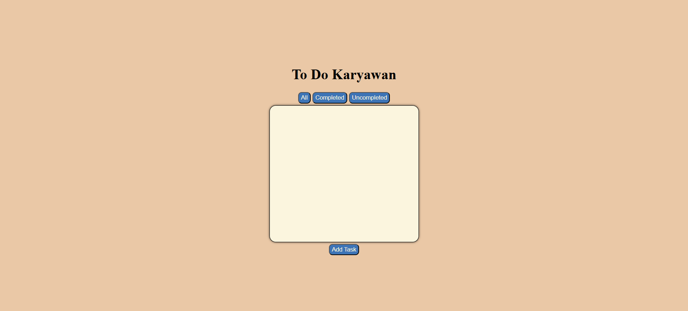
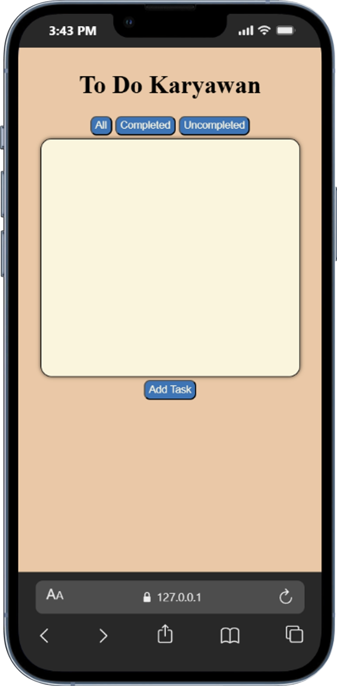
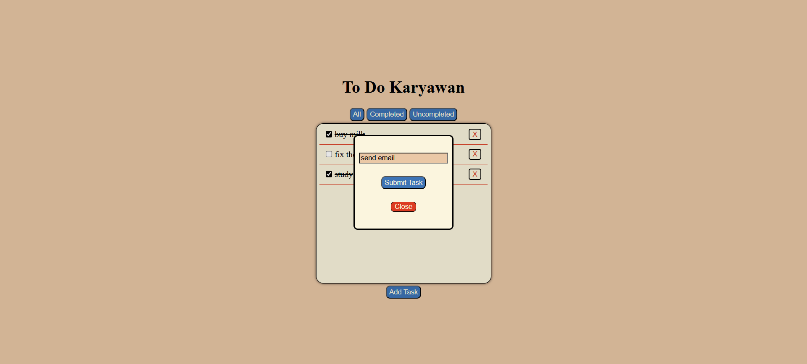
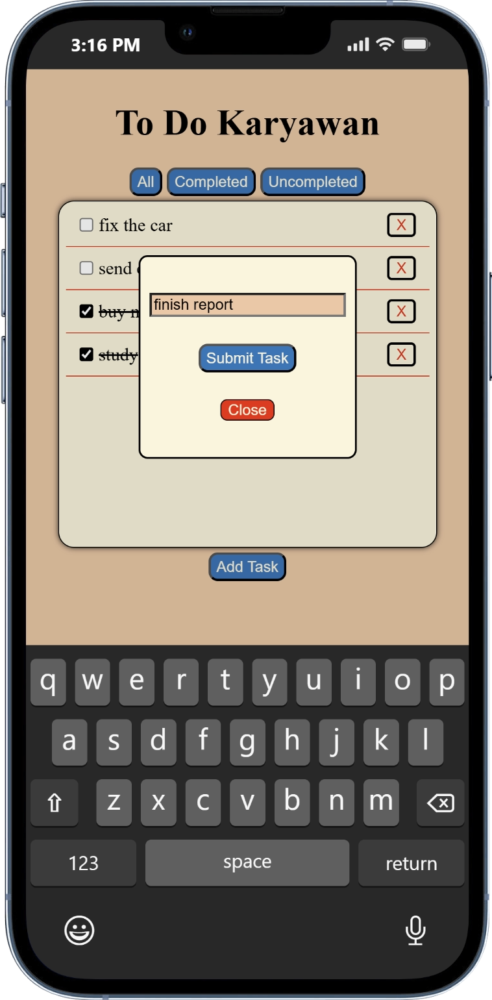
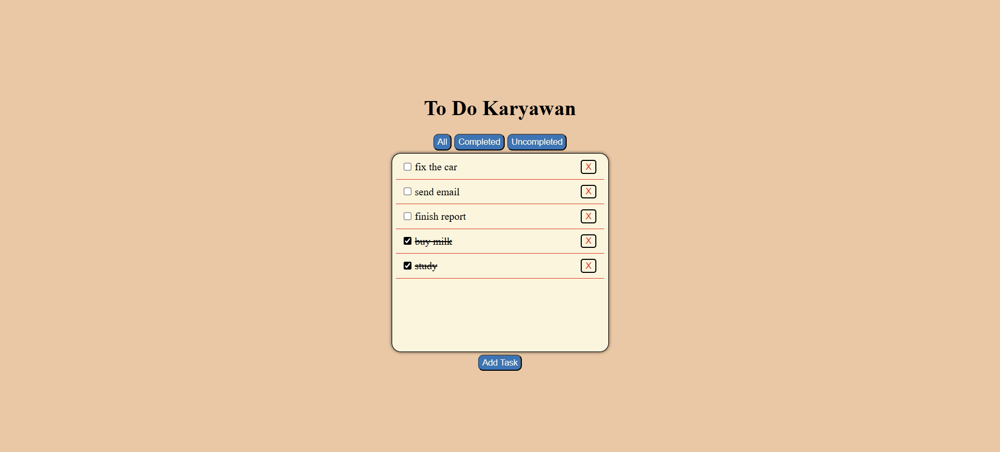
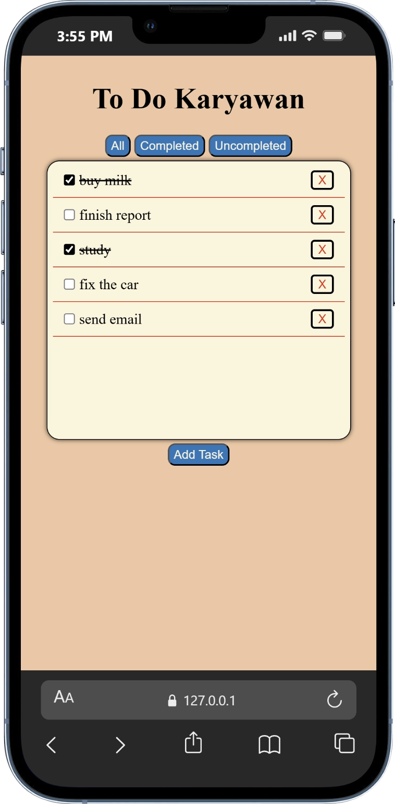
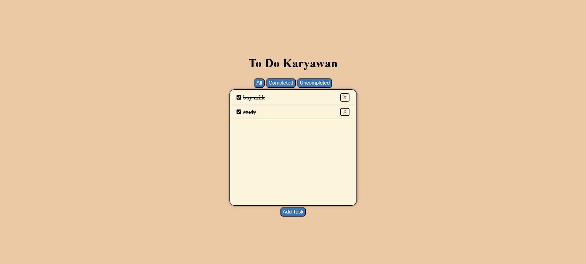
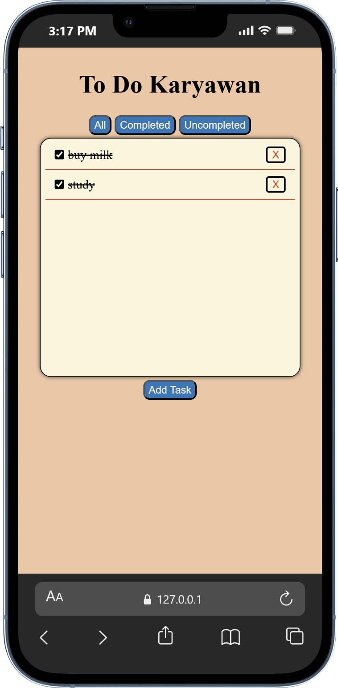
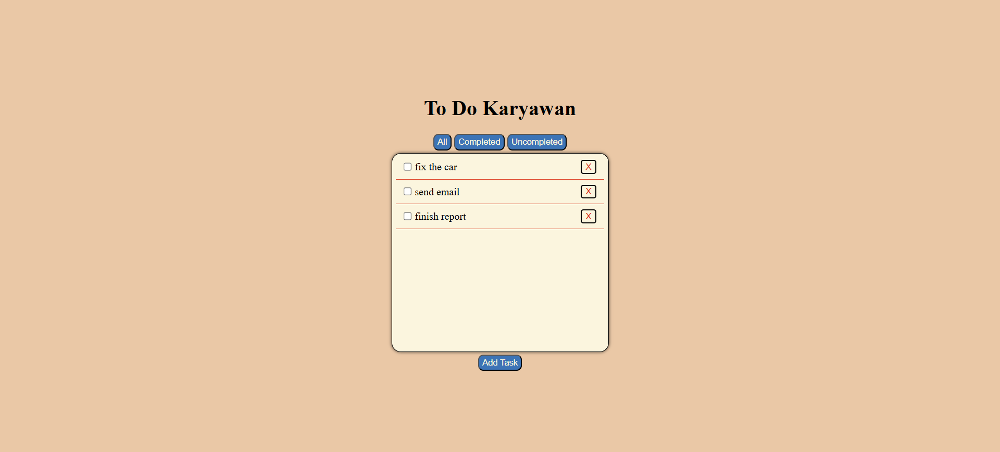
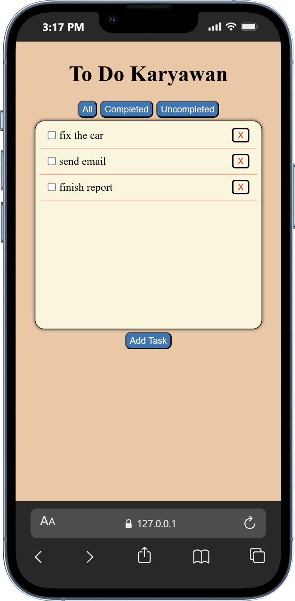

# Mini To-Do App

Mini To-Do App adalah aplikasi sederhana berbasis browser untuk menambahkan dan mengelola daftar tugas.

## Description

Mini To-Do App merupakan aplikasi sederhana yang dibuat untuk melatih manipulasi DOM menggunakan JavaScript.

User dapat menambahkan tugas, menandai tugas sebagai selesai, menghapus tugas, serta memfilter tugas berdasarkan statusnya. Semua data tugas disimpan sementara menggunakan array di JavaScript sehingga akan hilang ketika halaman di-refresh.

## Features

- Menambahkan task baru
- Menampilkan daftar task
- Menghapus task
- Penyimpanan task sementara menggunakan array JavaScript
- Filter task berdasarkan status (All / Completed / Uncompleted)

## Tech Stack

- HTML
- CSS
- JavaScript

## Learning Focus

- Manipulasi DOM
- Event handling
- Mengelola state sederhana menggunakan array
- Filtering data menggunakan JavaScript
- Interaksi user pada halaman web

## How to Run

Clone repository:

git clone https://github.com/jatpifaiz/mini-to-do-app.git

Buka file "index.html" di browser.

## Preview

**Blank To-Do List**

   

**Pop Up Add To-Do**

   

**All To-Do List**

   

**Completed To-Do List**

   

**Uncompleted To-Do List**

   

## Author

Jatpi Faiz Intipadah
