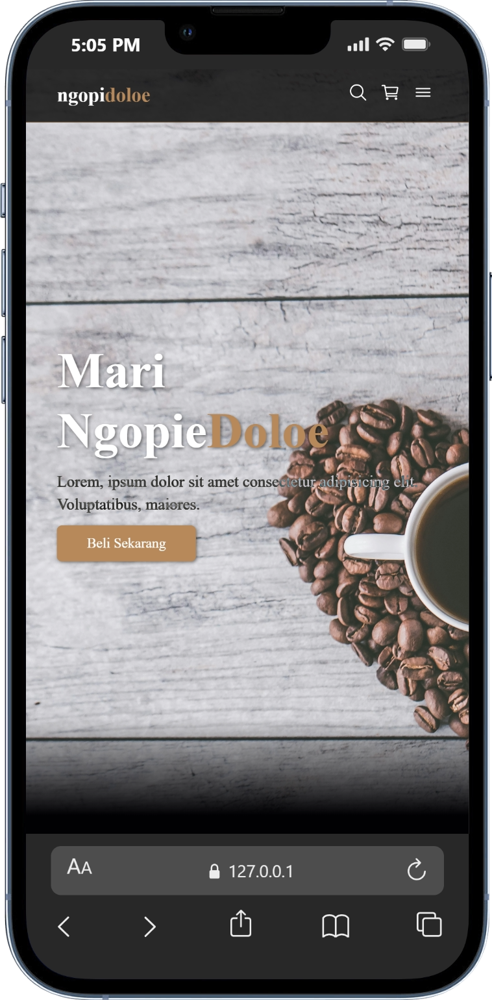
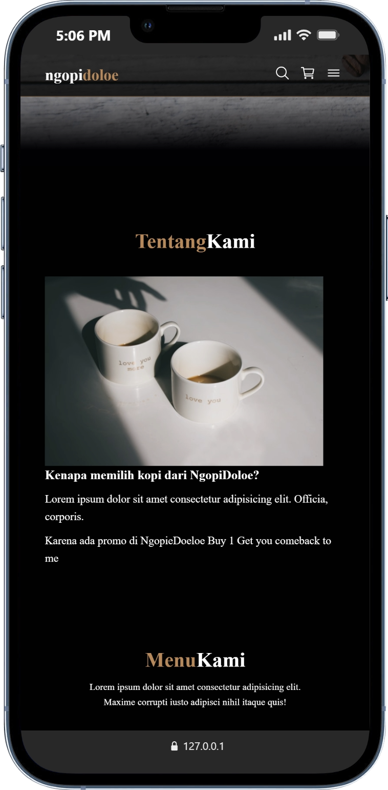
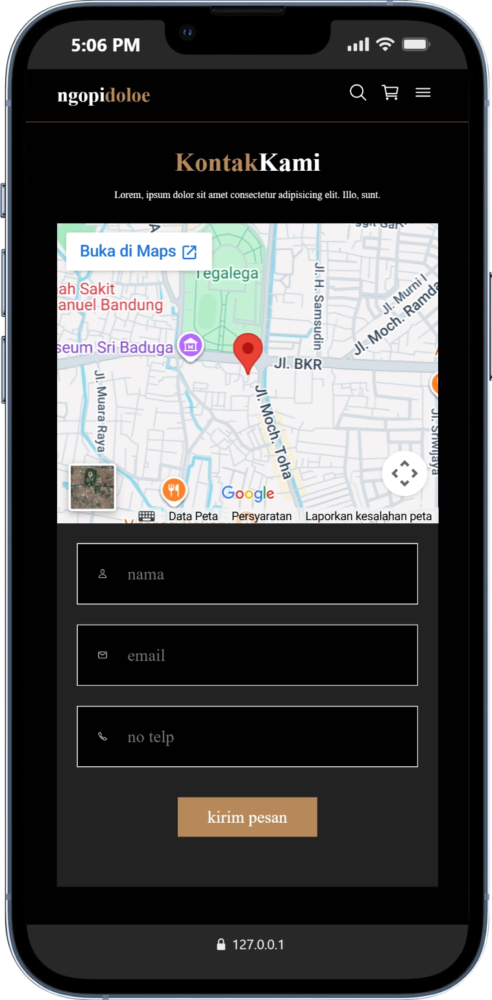

# ngopi doloe

Website statis sederhana yang dibuat untuk latihan membuat struktur halaman dan layout website.

## Description

ngopi doeloe merupakan website statis yang berisi beberapa section seperti hero, about, dan product showcase untuk latihan layout dan responsive design. Pada website ini, dibuat sedikit interaktif dengan ditambahkannya kode JavaScript, namun tidak menggunakan backend atau database.

## Features

- Navigation Bar
- Hero Section
- About Section
- Contact Section
- Responsive layout
- Simple Footer

## Tech Stack

- HTML
- CSS
- JavaScript

## Learning Focus

- Layout website
- Flexbox
- Responsive design
- Struktur section pada website
- Embedded Google Map for location
- Hamburger menu interaktif

## How to Run

Clone repository:

git clone https://github.com/jatpifaiz/ngopi-doloe.git

Buka file "index.html" di browser.

## Preview

**Hero Section**

   

**About Section**

   

**Menu Showcase**

   

**Contact Section**

   

## Author

Jatpi Faiz Intipadah
